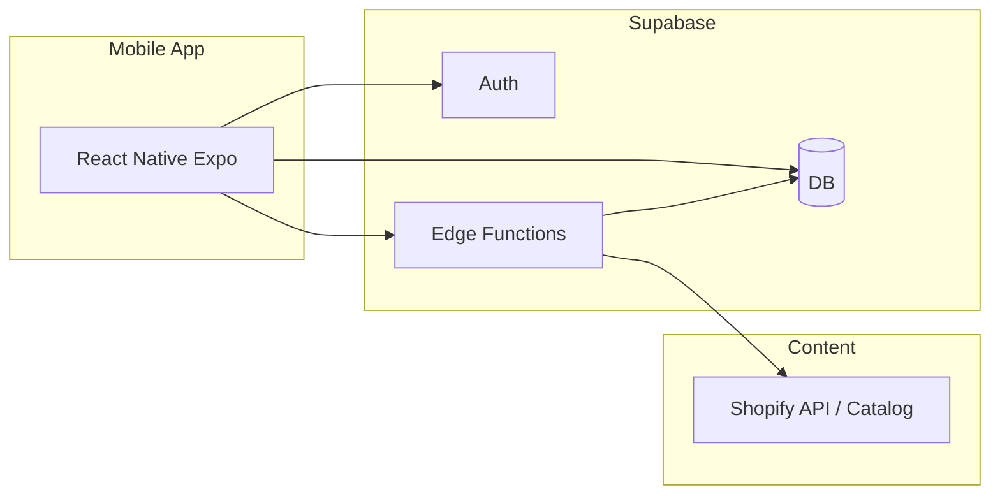

# StyleSwipe — High-Level Design Document

This document is the single source of truth for both **what** we're building and **how** we're building it. It merges product vision with technical architecture. [requirements.md](requirements.md) remains the product and feature checklist; here we focus on strategy, architecture, and implementation shape.

**Alignment note:** This document merges two earlier designs. We use **Supabase** as the backend (auth, database, Edge Functions). Product catalog is **Shopify Catalog API** and/or a curated dataset ingested into Supabase. Personalization is **heuristic tag-based scoring** (no ML in MVP), implemented in Supabase Edge Functions so the same logic runs for all clients. User data and swipes live in Supabase; optional client cache for performance or offline.

---

## 1. Vision and goals

**StyleSwipe is a personal AI stylist in your pocket.** Users discover their authentic style through intuitive swiping. The app learns their taste in real time and surfaces personalized product recommendations from real brands they'll actually love — not trending or one-size-fits-all.

**Core metaphor:** Tinder for fashion — swipe right to love it, left to skip it. Every swipe teaches the system a little more about you.

**Goals of this doc:** Define architecture (mobile + Supabase + content), tech stack, data model, content pipeline, how the AI works, core flows, screens, Supabase usage, user journeys, success metrics, constraints, roadmap, and what we're not building yet — so the team can build without guessing.

---

## 2. Problem we solve

**User pain points:**
- Fashion discovery is overwhelming (too many choices, no personalization)
- Browsing online is passive — users don't know what they actually want until they see it
- No quick way to filter, save, or organize favorites
- Generic recommendations don't match individual taste
- Building a cohesive personal style is time-consuming and confusing

**Why now:**
- Gen Z and millennials want faster, gamified discovery experiences
- Shopify Catalog API enables real product integration
- Mobile-first fashion browsing is the default behavior
- Heuristic tag-based personalization (no ML) keeps MVP simple and interpretable

---

## 3. Product strategy

### Target user
**Primary:** Fashion-conscious people aged 16–35 who want to refine their style and discover themselves through fashion.

**Secondary:** Shoppers looking for outfit inspiration and real product recommendations before buying.

### User value proposition
1. **Clarity** — "I finally understand my style"
2. **Speed** — "I found exactly what I wanted in 5 minutes"
3. **Discovery** — "I found brands and items I never would have seen"
4. **Confidence** — "I know these items work for my style"

---

## 4. Architecture overview

The system has three pillars. **We use Supabase as the backend; client-only persistence is not the primary store.**

1. **Mobile app** — React Native (Expo) client: swipe UI, onboarding, My Style, profile. Optional local cache (e.g. React Query, AsyncStorage) for fast load or offline.
2. **Supabase** — Auth, Postgres database, and Edge Functions for feed ranking, swipe submission, and My Style. Source of truth for users, profiles, swipes, and (optionally) ingested items.
3. **Content pipeline** — Shopify Catalog API (primary) and/or a curated dataset. Products are served via Supabase (Edge Function proxies Shopify or reads from `items` table). App never talks to Shopify or the dataset directly for feed; it calls Supabase.



- **App → Supabase:** Auth (login/signup), read/write swipes and profile, request feed and recommendations.
- **Supabase → Content:** Edge Function fetches or ranks products (from Shopify API or from `items` table after ingestion).
- **Edge Functions:** Feed (ranked by tag scores), submit swipe (writes swipes + updates profile tag_scores), My Style (liked items), optional Recommendations.

---

## 5. Tech stack

| Layer | Choice | Notes |
|-------|--------|--------|
| **Mobile** | React Native + Expo (managed workflow) | Single codebase for iOS/Android; Expo simplifies builds and OTA updates. |
| **Navigation** | Expo Router | File-based routing; fits Expo and keeps navigation declarative. |
| **State** | React state + context for UI; Supabase for persistence | Profile, swipes, and feed from Supabase. Optional: React Query or SWR for feed/API caching; AsyncStorage for offline or fast load. |
| **Backend** | **Supabase** | Postgres (profiles, items, swipes); built-in Auth and RLS; Edge Functions for feed, swipe, and recommendation logic. SQL and RLS for multi-tenant data. |
| **Content** | Shopify Catalog API and/or curated dataset | Primary: Shopify (real products, images, buy links, tags). Option: dataset ingested into `items`. Feed served via Supabase. |
| **AI/ML (MVP)** | Heuristic tag scoring in Edge Function | No ML. Tag affinity per user (0.0–1.0); boost on like, penalty on skip; rank by tag match. Implemented in Supabase Edge Function. |

---

## 6. Data model

**Supabase tables:**

- **profiles** — Keyed by Supabase Auth user id. Fields: `created_at`, `has_onboarded`, `tag_scores` (JSON: tag → affinity 0.0–1.0), `preferred_styles`, `preferred_colors`, `preferred_categories`. Updated by Edge Function on each swipe and during onboarding.
- **items** — Id, `image_url` (or storage key), `source` (e.g. "shopify" or dataset name), metadata (brand, price, buy_url, etc.), `tags` (array). Populated from Shopify or ingestion.
- **swipes** — `user_id`, `item_id`, `direction` (like/skip), `timestamp`. Right swipes drive My Style and feed ranking; all swipes drive tag-score updates.

**Derived:**
- **Style DNA** — Top N tags (e.g. 5) from `profiles.tag_scores`; shown in My Style.
- **My Style** — User's right swipes joined to `items` for display (grid, buy link, remove).

**Conceptual shapes (for readability):**

```
Profile {
  hasOnboarded: boolean
  tagScores: { "black": 0.72, "minimalist": 0.68, ... }
  preferredStyles: string[]
  preferredColors: string[]
  preferredCategories: string[]
}

Swipe {
  userId: uuid
  itemId: uuid
  direction: "like" | "skip"
  timestamp: ISO8601
}
```

No full schema DDL in this doc; that can live in the repo or a separate spec.

---

## 7. Content pipeline

- **Primary: Shopify Catalog API** — Real products with images, prices, buy links, and rich attributes (color, material, category, occasion). Edge Function calls Shopify (bearer token, cached) and returns products to the app; or we ingest into `items` and serve from Postgres.
- **Option: Curated dataset** — e.g. DeepFashion or a fixed JSON/CSV. One-time or periodic ingestion into `items` table (and Storage for images if needed). Edge Function then serves feed from `items`.
- **Serving:** App requests feed from Supabase only. Edge Function returns ordered list of items (and optionally pre-signed URLs). Content source is an implementation detail behind Supabase.
- **Fallback:** Mock data (e.g. 20 curated products) for demo or when API is unreachable; seamless UX so the user never sees an error.

---

## 8. How the AI works

Not machine learning — **heuristic tag-based scoring**, implemented **server-side** in a Supabase Edge Function.

**Model:**
- Each product has tags (color, style, category, material, occasion).
- Each user has a taste profile = affinity scores for tags (0.0–1.0), stored in `profiles.tag_scores`.

**Learning loop (on every swipe):**

```
User swipes right (loves it)
    → Extract product's tags
    → Boost those tags in user's profile (+0.15)
    → Slight decay all other tags (×0.98)
    → Next feed ranked by average tag match

User swipes left (skips it)
    → Slight penalty to those tags (-0.05)
    → Rest of loop same
```

**Result:**
- After ~5 swipes: feed personalization kicks in.
- After ~20 swipes: noticeable preference clustering.
- No cold-start problem: onboarding seeds initial preferences into `tag_scores`.

**Contract:** Edge Function input: `user_id`, `limit`, optional filters. Output: ordered list of items (or item ids). Style DNA = top 5 tags from `profiles.tag_scores`.

**Why this works:** Transparent (user sees top 5 tags in Style DNA), interpretable, extensible. Same logic for all clients because it runs in Supabase.

**Later:** Embeddings, "why you might like this" explanations, real brand APIs.

---

## 9. Core flows

**The loop:**
```
User Opens App
    ↓
[Onboarding] Select initial preferences (optional, skip anytime)
    ↓
[Swipe Screen] See product → Swipe right (love) or left (skip)
    ↓
Edge Function updates tag_scores; next feed more personalized
    ↓
[My Style] Tap to see saved items and Style DNA
    ↓
[Buy] Tap "Buy Now" → product buy link (e.g. Shopify)
```

- **Onboarding** — Welcome, Style Picker, Color Picker, Category Picker. Persist to `profiles` in Supabase; seed `tag_scores` if provided. Then navigate to Discover.
- **Swipe session** — App fetches next N items from feed Edge Function. On each swipe: call submit-swipe Edge Function (writes `swipes` + updates `profiles.tag_scores`); update local queue; prefetch when queue low. Card stack animates smoothly (e.g. card off-screen on swipe). Maintain queue of ~3–50; auto-refresh when &lt; 3 remain.
- **Feed generation** — Edge Function returns items ranked by user's current tag scores. MVP: heuristic only; later: optional embeddings.
- **My Style** — Query Supabase for user's right swipes + item details. Grid, Style DNA banner, Buy Now / Remove.
- **Recommendations** — Same ranking as feed; can be same endpoint with a flag or a dedicated "recommended products" endpoint.

---

## 10. Screens and navigation

**Pattern:** Tab-based main app (Discover, My Style, Profile). Onboarding = stack shown for first-time users; skip anytime.

**Onboarding stack:**
1. **Welcome** — "Learn your style by swiping"
2. **Style Picker** — Select aesthetic preferences
3. **Color Picker** — Favorite color palettes
4. **Category Picker** — What do you shop for?
5. → Start swiping

**Main tabs:**
- **Discover (primary)** — Swipe feed (one card at a time). Product info: brand, title, price, image. Auto-loads more as queue depletes. "My Style" entry (e.g. top right).
- **My Style** — Saved items grid (e.g. 2 columns). Style DNA banner (top 5 tags). Buy Now / Remove. Empty state if no saves. "Discover" to return to feed.
- **Profile** — Account, theme (dark/light), about.

**Navigation:** Expo Router. Routes e.g. `(tabs)/index`, `(tabs)/my-style`, `(tabs)/profile`, `onboarding`.

---

## 11. Supabase usage

- **Auth:** Email/password or OTP for MVP. User id from Auth links to `profiles` and `swipes`. Optional: anonymous auth for "try before sign-up," then convert to permanent account.
- **Data:** Tables `profiles`, `items`, `swipes`. RLS: users read/write only their own profile and swipes; `items` read-only for app users.
- **Edge Functions (API surface):**
  - **Feed** — In: `user_id`, `limit`. Returns ordered list of items (ranked by tag scores). May call Shopify or read from `items`.
  - **Submit swipe** — In: `user_id`, `item_id`, `direction`. Writes to `swipes` and updates `profiles.tag_scores`. Out: success/error.
  - **My Style** — In: `user_id`. Returns user's liked items (right swipes + item details). Out: list of items.
  - **Recommendations** (optional) — Same as feed with "recommended" semantics; In: `user_id`, `limit`. Out: list of items.

Full request/response shapes can live in a separate API spec or in the repo.

---

## 12. User journeys

**Happy path (~3 min):**
1. Open app
2. Tap "Skip" onboarding (optional)
3. Swipe 5–10 products (left/right)
4. Tap "My Style" → See 2–3 saved items
5. Tap "Buy Now" → Opens product page (e.g. Shopify)
6. Close app
7. Reopen later → Profile and swipes in Supabase; continue swiping

**Power user (~15 min):**
1. Complete onboarding (select 5+ preferences)
2. Swipe 50+ products (feed auto-refreshes)
3. Build collection of 20+ saved items
4. Observe Style DNA evolve
5. Share collection (future feature)

**Casual browser:**
1. Skip onboarding
2. Swipe 3–4 products
3. Close app
4. Return later → Profile and history in Supabase; feed continues from ranking

---

## 13. Success metrics

**Engagement:** Session length 5–10 min; 10–20 swipes per session; 30% return within 7 days.

**Personalization:** Save rate 15–25%; top 5 tags stabilize after ~20 swipes; ranking accuracy (user saves &gt; 30% of top-10 ranked items).

**Commerce (nice-to-have):** Click-through to buy page 20% of saved items; brand distribution (no single brand &gt; 40% of saves); price range spread.

---

## 14. Constraints and assumptions

**Technical:** Supabase required. Network needed for feed and swipes; optional client cache for offline or fast load. No ML/NLP in MVP — heuristic tag-based only. Mobile-first (iOS + Android via React Native).

**Business:** User accounts via Supabase Auth (multi-device possible). No social in MVP (sharing later). Algorithm-driven only; no custom curation. Attribution ("why we picked this") optional later.

**User assumptions:** Users have 5+ min of intent per session; enjoy swiping; trust product/brand links; understand minimal UI.

---

## 15. Roadmap

**Phase 2: Cloud & Social** — User accounts and multi-device sync are satisfied by Supabase. Add: share collections, comment on saved items.

**Phase 3: Intelligence** — "Why I like this" (matching tags); smart filters (price, brand, category); trending in your taste; recommendations from designers.

**Phase 4: Commerce** — In-app checkout; affiliate commissions; direct brand partnerships; ads.

---

## 16. Out of scope / later

- Real brand partnership APIs and revenue share
- Advanced ML (custom training, A/B tests, full "why you like this" model)
- Offline-first sync, push notifications, sharing (from requirements nice-to-have)
- Full schema DDL and detailed API request/response examples (separate doc or repo)

**Competitive edge:** Gamified, real-time personalization with zero friction.

**Go-to-market:** Hackathon demo → Beta (TestFlight, Shopify) → Soft launch (iOS US) → Android later. Marketing: TikTok, Instagram, fashion communities. Monetization (Phase 2): brand partnerships, affiliate, premium tier.

---

## 17. Summary

StyleSwipe is a Supabase-backed mobile app (React Native + Expo) that turns fashion discovery into a fun, personalized experience. Users swipe to learn about themselves; heuristic tag-based scoring in Supabase Edge Functions learns from every swipe and serves a ranked feed and Style DNA. Product catalog comes from Shopify Catalog API and/or a curated dataset ingested into Supabase. One doc for both product intent and technical "how."

**The bet:** Gamification + instant personalization beats generic recommendations.
